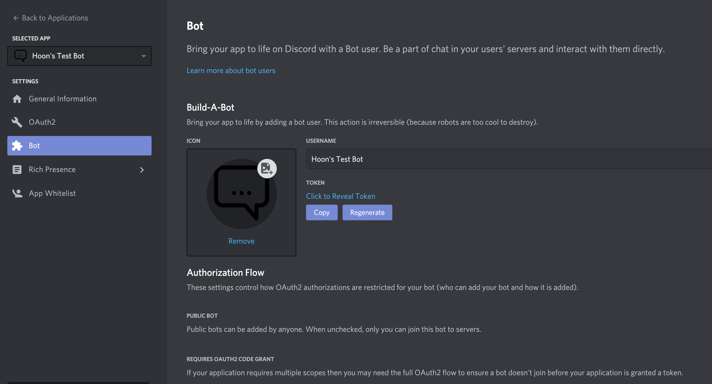
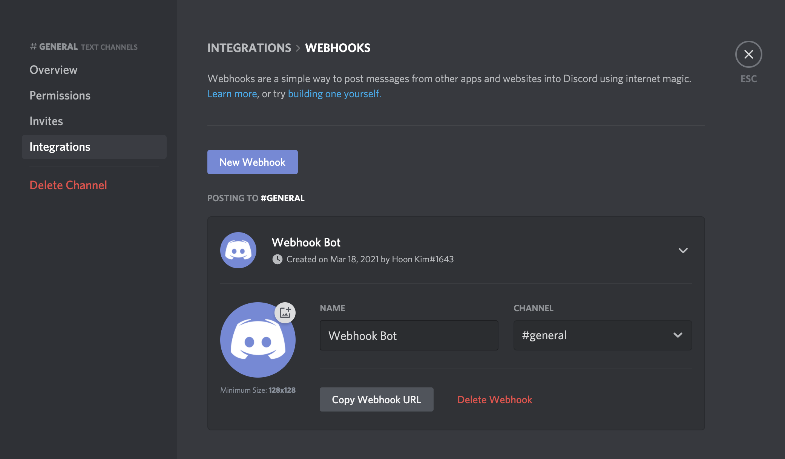

# Discord Bot Starter Project

## About

This is a Discord bot starter project made with [Discord.js](https://discord.js.org/#/docs/main/stable/general/welcome).
This starter is focused on developing a full distributable Discord server bot or a light-weight webhook integration bot.

## Usage

### Setting Up

Before starting the server, you need to first create a `.env` file with the following variables.

```env
# used for server bots
DISCORD_TOKEN=<discord bot token>
# used for webhook app
WEBHOOK_ID=<discord channel webhook client id>
WEBHOOK_TOKEN=<discord channel webhook client token>
```

Next, ensure that you have a usable Discord app on your developer portal.
If you do not have a Discord app, you can create one from here: <https://discord.com/developers/applications>.

For creating channel-specific webhook integrations, you only need the channel editing permissions to add integrations.

Unlike a full Discord app, webhooks are light and simple, but limited in it's features.
Discord webhooks do not require any bot credentials, but they are only limited to a specific channel and do not have access to advanced RPCs.
If you want to create a simple message subscription feature to a certain channel without any reactivity (e.g., a bot for sending Slack messages to Discord), webhooks will do the job.
If you need advanced features like reading server (guild) information and user permissions or react to certain events, you will need to set up a full Discord bot.

### Obtaining Credentials

Discord bot token is used to login to Discord as a bot user.



Click on the 'Copy' button under the 'Tokens' section to get your bot token.
Then paste it as the value for `DISCORD_TOKEN` in your `.env` file.

For adding a channel webhook integration, you need to first create a webhook under the 'Channel Edit' -> 'Integration' settings.



Click on the 'Copy Webhook URL' button to request the webhook URL.
The webhook URL has the following format `https://discord.com/api/webhooks/<webhook-id>/<webhook-token>`.

For example:

```url
https://discord.com/api/webhooks/12345678910/fewgg-PFEfew_efgg2-fgWEGWG33g-fewgewg-sadfewgw
```

### Scripts

```bash
# install all the dependencies
yarn

# starts a local server that runs from a transpiled source to emulate production
yarn start
yarn serve

# starts a development server that runs in ts-node
yarn dev

# transpile the project into production-optimized javascript
yarn build
```

## Further Readings

For more information, please refer to the official Discord developer portal or the Discord.js documentation.

- <https://discord.com/developers/docs/intro>
- <https://discord.js.org/#/docs/main/master/general/welcome>
